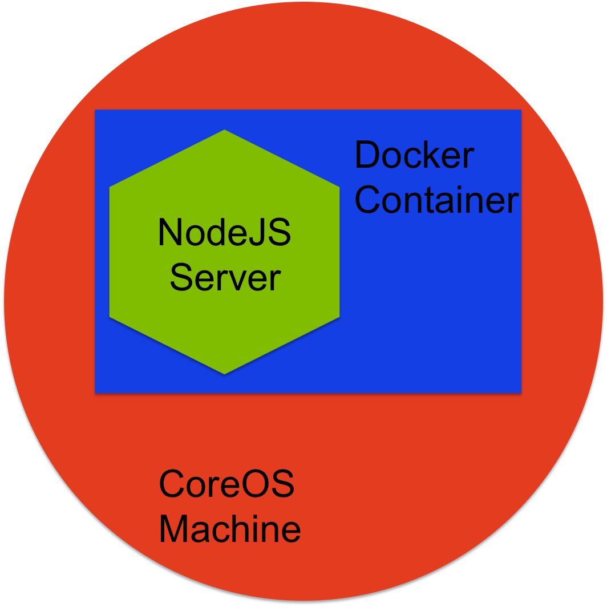

# CoreOS-Reflector


"Hello World" introduction to CoreOS and Docker.

## Introduction
The way we write web apps is evolving in exciting ways.  One important change is the emergence of technologies that allow for consistent, automated deployment of your app.  CoreOS is an impressive platform that gives you this power.  This tutorial will take you through the basics of spinning up and controlling CoreOS.

## Architecture
Let's talk about what goes into CoreOS.  Here is a diagram to give you a feel for how this example is built and what we're going to talk about.
<br>
<br>



---
### CoreOS
So, what is CoreOS?  Strictly speaking, it *is* an operating system, but just barely.  It is a super-lightweight version of Linux that has been almost entirely hollowed out.  But like any good operating system, CoreOS handles pesky details and offers developers a hardware-agnositic target.  

What *really* makes CoreOS special is how it's designed to cluster with other CoreOS machines.  You can build out clusters of arbitrary size, and working together, they can efficiently scale your app in a way that wasn't possible before without a full team of dedicated DevOps.  

This clustering capability is outside the scope of this basic tutorial. For now, we will limit our focus to getting a single machine spun up.  But as you'll find out, defining one machine is all you need to summon a cluster for all your needs.

---
### Docker
We've established CoreOS as this nifty, light-weight OS, but it does almost nothing except super-efficiently cluster with itself.  Now we introduce the next technology in this stack.  CoreOS is built from the ground up to accept Docker containers.

Docker containers are virtual machines (VM), which means they are programs that need to run in a true operating system, but inside they are emualting their own environment, including their own operating system.  This can sound weird at first, so let's take a step back to clarify.  

A great way to think about this is like going to the movies.  CoreOS is like the theater. It's a mostly hollow, unchanging platform that acts like a foundation for the whole process.  A Docker container is like the movie that gets played in that theater.  The theater doesn't change, but movies can emulate wildly different environments.

Docker containers are incredibly powerful.  And the images that fill them are available for download in a public registry.  Do you want to run your app on Ubuntu or Arch?  Do you need a database like Redis or Elasticsearch?  What code library do you need?  Ruby? Java? Go? Fortran???  It doesn't matter.  Whatever you need can be snapped together like Legos, and then the whole container just gets dropped into a CoreOS machine.

---
### NodeJS
Docker containers are very flexible and you could end up with any number of setups inside.  But, for this example we want to keep things simple.  We have a soft spot for NodeJS (which is awesome), so we load it into a Docker container and use it to build a simple server.


# Demo - Let's Build Something!
Please clone this repository before continuing.  You will need its files to follow along.  You will place files from this repo into a second repo you will download shortly.

Also, CoreOS makes use of fleetctl and etcd to control machines in the cluster.  These tools can be installed via the following commands on OSX:
  ```
  brew install fleetctl
  brew install etcd
  ```

---


## Vagrant
### Introduction
If you have a remote server, you can install CoreOS there and follow along.  However, this example will show you how to get something working right on your local machine.  To make that happen, we use a program called Vagrant.  It generates a "virtual development environment", which means it creates a cluster of many virtual machines, right on your laptop.  However, we only need to ask for one CoreOS machine for this example.

---
- [Download Vagrant](We only need one CoreOS machine here, but Vagran)
- You'll need to have Vagrant and VirtualBox configured properly.  The easiest way is to download this repository from CoreOS.  It comes with defaults that we will only need to tweak a litte.
    `git clone https://github.com/coreos/coreos-vagrant.git`


## etcd
### Introduction
CoreOS depends on efficient communication to suppport its clustering technology.  etcd is a key-value store similar to Redis that facilitates this communication.  While it is mostly automatic, we do have to do some configuration to make sure all the CoreOS machines can find each other and elect a leader.  

- Change directory into the coreos-vagrant directory.

  `cd coreos-vagrant`

- Place the file `coreos-reflector/coreos/config.rb` from this repo here.  This Ruby file specifies how many CoreOS machines to generate and what version of the software they will run.  We specify 1 instance and the 'stable' channel.

  `cp path/to/coreos-reflector/coreos/config.rb .`

- Place the file `coreos-reflector/coreos/user-data` from this repo here.  This Yaml file specifies services available in the cluster.

  `cp path/to/coreos-reflector/coreos/user-data .`

- We need to alter `user-data`.  Follow [this link](https://discovery.etcd.io/new) to a CoreOS service that prints out a URL to the screen.  Copy that URL and place it, in its entirety, in the field `discovery`.  CoreOS machines use this URL to bootstrap the process of finding each other and setting up a cluster.  
**NOTE: The cluster will fail if this step is not repeated before every cluster startup.  The service does not persist when the cluster is destroyed.**

## Cluster Startup
We are now ready to activate a cluster of empty CoreOS machines.  Remember that we have only requested one machine for this example.

Place the file `coreos-reflector/coreos/vagrant-setup` from this repo here.  This is a bash script that handles some of the issues with starting up a cluster in Vagrant.

  `cp path/to/coreos-reflector/coreos/vagrant-setup .`

Let's take a minute to go over the commands listed here.

- `vagrant up` -> This is the command used to build a cluster.  It will pull settings from the two config files `config.rb` and `user-data`.  The command `vagrant destroy -f` is used to stop the whole cluster.

- Next we have these commands.  Our aim is to remove old machine keys from known_hosts.  Vagrant will repeatedly spin up machines at the same IP address, but they will have different public keys.  Without deleting the old keys, SSH will not allow a connection.  The keys are stored in the `.fleetctl` directory, but the path to that directory will depend on where fleetctl was installed.
  ```
  # Delete the old known hosts so that we don't run into SSH errors.
  rm /Users/David/.fleetctl/known_hosts
  touch /Users/David/.fleetctl/known_hosts
  ```

- And finally, you must give the the cluster your public key so it will allow access as a known peer.  The sed command accomplishes what we need.
```
# Give the cluster your public key
vagrant ssh-config | sed -n "s/IdentityFile//gp" | xargs ssh-add
```

- **Now, we are ready to start!!**  The command fleetctl is paired with an ssh tunneling command.  fleetctl is passed the flag `start` and the path to what is called a service-file. Service files list out exactly what CoreOS does before it starts up a Docker container.  It is based on systemd, and [you can read about its specifications here](http://www.freedesktop.org/software/systemd/man/systemd.unit.html).  The file provided in the reflector repository calls for a Docker container listed in the public registry.

- Start the cluster:
`fleetctl --tunnel 127.0.0.1:2222 start /path/to/coreos-reflector/reflector.service`
 You will see a message stating that the service has been started at a specific IP address.  Save the address because we will point our browser at it shortly.  

- Progress can be viewed using the journal command:
`fleetctl --tunnel 127.0.0.1:2222 journal -follow=true /path/to/coreos-reflector/reflector.service`

It will take a couple minutes for the Docker container to be downloaded and processed.  You will see a message `The server is online and listening on Port 80`
When you see this, you can direct your browser to the IP address you saved.  You should see something similar to this on the screen.

```
Hi there.  I've received your request loud and clear.  I've reflected it back to you here:
======================
Host: 172.17.8.101
Accept: text/html,application/xhtml+xml,application/xml;q=0.9,image/webp,*/*;q=0.8
httpVersion: 1.1
Method: GET
URL: /
======================
```


If you see that, then you successfully started a CoreOS cluster, loaded Docker image, and launched a Node server that is reflecting your rquest back to you.  Congratulations.
